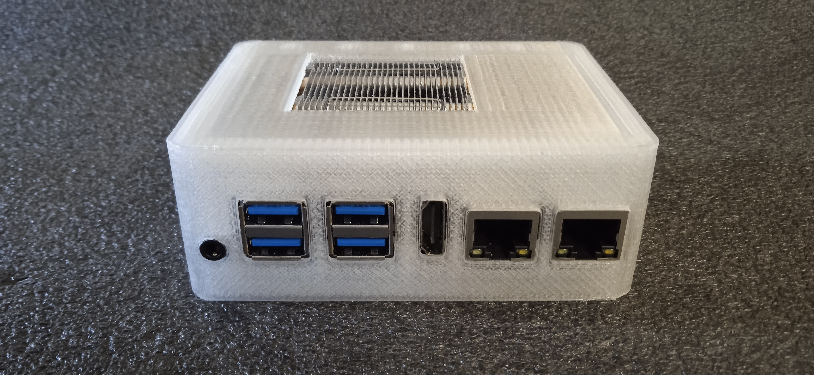

# StarFive VisionFive 2 snap case

There are two versions of the case uploaded as stl files:

- Type A conceals most of the details about the case assembly process (only one
snap knob is accessible, back lid occupies only the back face) and already has all required
supports by design.
- Type B is easier to assemble and requires no supports at all.
- Both versions take into account "ice tower" fan and M2 SSD with max height of 8 mm 
when mounted.

Different types of cases could be created with OpenSCAD customizer. Before printing custom
case please check everything twice since it is possible to generate unusable case when 
moving far away from provided parameter presets. 

All cases in the photos were printed using PETG and a layer height of 0.2 mm.
